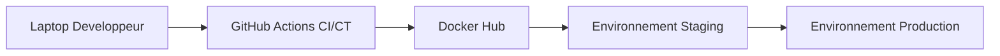
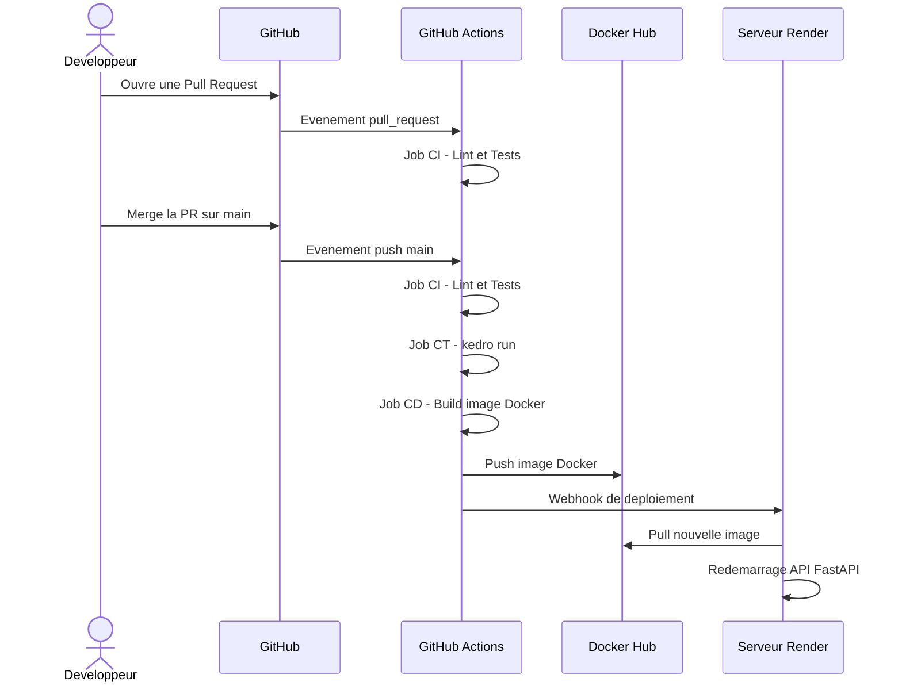
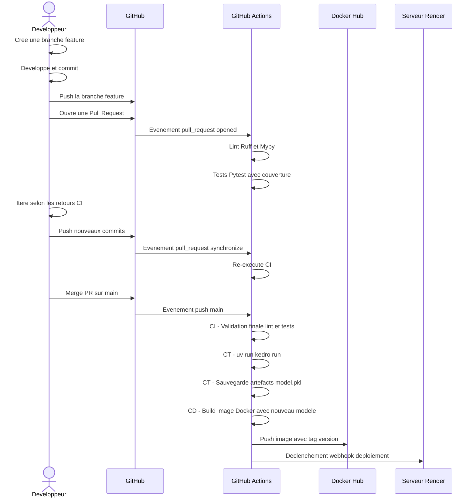
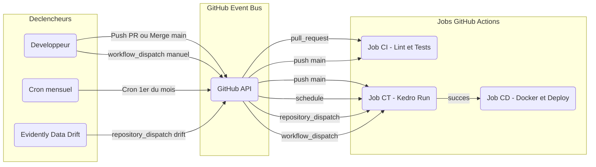

# Architecture du Pipeline CI/CD/CT MLOps

Ce document présente l'architecture visuelle du pipeline d'intégration, de déploiement et d'entraînement continus (CI/CD/CT) pour le projet de Credit Scoring (Kedro + FastAPI + Docker).

---

## 1. Vue d'ensemble des Environnements

Contrairement à un package Python classique publié sur PyPI, un projet MLOps déploie une API conteneurisée et gère des modèles de Machine Learning.

---

## 2. Workflow CI/CD/CT Haut Niveau

---

## 3. Workflow CI/CD/CT Détaillé

---

## 4. GitHub Actions comme Système Pub-Sub MLOps

Dans un contexte MLOps, les déclencheurs sont plus variés pour gérer le réentraînement automatique.

---

## 5. Stratégie de Réentraînement (Continuous Training)

Le réentraînement du modèle est déclenché par quatre types d'événements distincts :

| Déclencheur | Mécanisme | Cas d'usage |
|---|---|---|
| **Nouveau code** | `push` sur `main` | Modification des hyperparamètres ou du feature engineering |
| **Temporel** | `schedule` cron mensuel | Intégration des nouvelles données collectées |
| **Data Drift** | `repository_dispatch` webhook | Dégradation détectée par Evidently en production |
| **Manuel** | `workflow_dispatch` | Forçage par un administrateur depuis l'interface GitHub |
